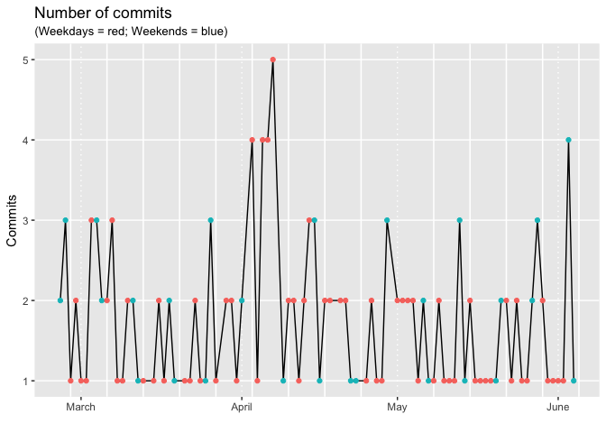
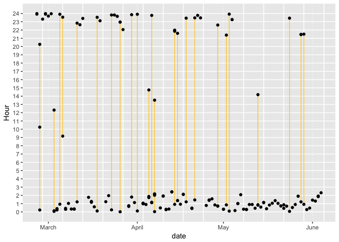
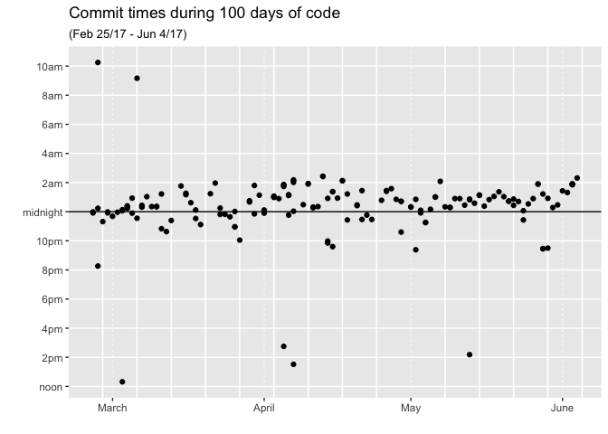

# Day100: Reflection
csiu  


## Data

To get all the commits made on my master branch:

`git log master > git-commits.blog.2017-06-04.log`

I now need to wrangle it to a workable format:

```
# ------------------------------------------------------------------------------
# Following code reformat this:
#
# commit ddf53d3b9054a537b16d2ad217c7435a976c871f
# Author: csiu
# Date:   Sun Jun 4 02:19:12 2017 -0700
# 
#     constraints vs priors
# 
# commit cd0160bf7f233d5e9bccff5bc7f3079852b43910
# Author: csiu
# Date:   Sat Jun 3 01:55:02 2017 -0700
#
#      more fixes -- doesn't help to be doing this at 2 in the morning
# 
# ------------------------------------------------------------------------------
# To this:
# 
# Date:   Sun Jun 4 02:19:12 2017 -0700	    constraints vs priors
# Date:   Sat Jun 3 01:55:02 2017 -0700	    more fixes -- doesn't help to be doing this at 2 in the morning

cat git-commits.blog.2017-06-04.log |
  grep -A2 ^Date |
  perl -pe 's|^\s+||' |
  grep -vE '^-{0,2}$' |
  tr '\n' '\t' |
  perl -pe 's|$|\n|; s|Date|\nDate|g' |
  perl -pe 's|\t$||g; s|^Date:\s{4}||' |
  grep -v "^$" > \
    git-commits.blog.2017-06-04.txt
```

Read it in R


```r
commits <- 
  readr::read_tsv("data/git-commits.blog.2017-06-04.txt",
                  col_names = c("raw", "Comment")) %>%
  select(-Comment) %>%
  mutate(raw = sub("^Date:\\s+", "", raw),
         raw = sub("\\s-?\\d+$", "", raw),
         
         # Generate date objects
         dttm = parse_date_time(raw, "%a %b %d %H:%M:%S %Y"),
         date = as.Date(dttm))
```

```
## Parsed with column specification:
## cols(
##   raw = col_character(),
##   Comment = col_character()
## )
```

## 100 days of code

I started this project on Feb 25, 2017.


```r
start_date <- "2017-02-25"
end_date <- "2017-06-04"

# Filter commits to include only those in the 100 days
commits <-
  commits %>%
  filter(date >= start_date,
         date <= end_date)
```

Ideally I make 1 commit per day, but this was not the case


```r
# Number of commits in 99 days
nrow(commits)
```

```
## [1] 160
```

Most commits were made during the second week of April


```r
commits %>%
  count(date) %>%
  mutate(
    weekdays = weekdays(date),
    is_weekend = weekdays %in% c("Saturday", "Sunday")
    ) %>%
  ggplot(aes(x=date, y=n)) +
  geom_line() +
  geom_point(aes(color=is_weekend)) +
  scale_x_date(date_breaks = "1 month", date_minor_breaks = "1 week", date_labels = "%B") +
  xlab("") +
  ylab("Commits") +
  ggtitle(label = "Number of commits", 
          subtitle = "(Weekdays = red; Weekends = blue)") +
  theme(
    legend.position = "none",
    panel.grid.minor.y = element_blank(),
    panel.grid.major.x = element_line(linetype = "dotted", size = 0.5),
    panel.grid.minor.x = element_line(size = 0.55)
  )
```

<!-- -->

Another point of interest is time. Time of last commit for the day.


```r
commits %>%

  mutate(
    time = hour(dttm) + minute(dttm)/60
  ) %>%
  
  ggplot(aes(x=date, y=time)) +
  geom_line(aes(group=date), color="#ffcc33") +
  geom_point() +
  scale_y_continuous(breaks = 0:24, minor_breaks = seq(0,24,0.5)) +
  scale_x_date(date_breaks = "1 month", date_minor_breaks = "1 week", date_labels = "%B") +
  ylab("Hour") +
  theme(
    legend.position = "none",
    panel.grid.minor.y = element_blank(),
    panel.grid.major.x = element_line(linetype = "dotted", size = 0.5),
    panel.grid.minor.x = element_line(size = 0.55)
  )
```

<!-- -->

In the figure above, I highlight the multiple commits I made in a day. For instance, in the last week of February, I've commited late Day2, on time on Day3, and early on Day4.


```r
commits %>%
  mutate(
    time = hour(dttm) + minute(dttm)/60,
    new_time = ifelse(time < 12, time + 12, time - 12)
  ) %>%
  ggplot(aes(x=date, y=new_time)) +
    geom_point() +
    geom_hline(yintercept = 12) +
  scale_y_continuous(breaks = seq(0,24,2),
                     minor_breaks = seq(0,24,0.5),
                     labels = c("noon", "2pm", "4pm", "6pm", "8pm", "10pm", 
                                "midnight", "2am", "4am", "6am", "8am", "10am", "noon")) +
  scale_x_date(date_breaks = "1 month", date_minor_breaks = "1 week", date_labels = "%B") +
  ylab("") +
  xlab("") +
  ggtitle(label = "Commit times during 100 days of code",
          subtitle = "(Feb 25/17 - Jun 4/17)") +
  theme(
    legend.position = "none",
    panel.grid.minor.y = element_blank(),
    panel.grid.major.x = element_line(linetype = "dotted", size = 0.5),
    panel.grid.minor.x = element_line(size = 0.55)
  )
```

<!-- -->

Centering the commits around midnight, I can see that I've mostly commited past midnight... At least I'm consistent.
